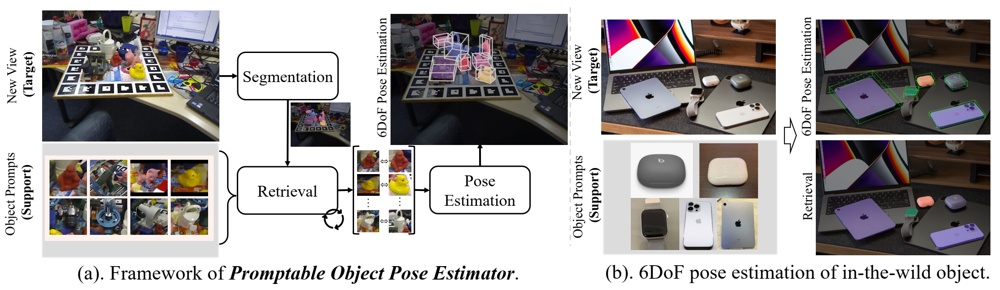
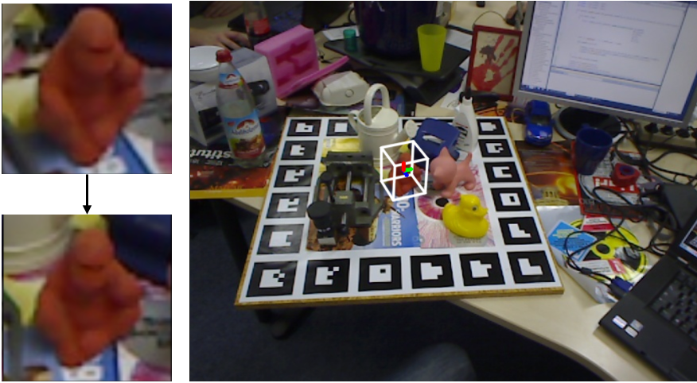
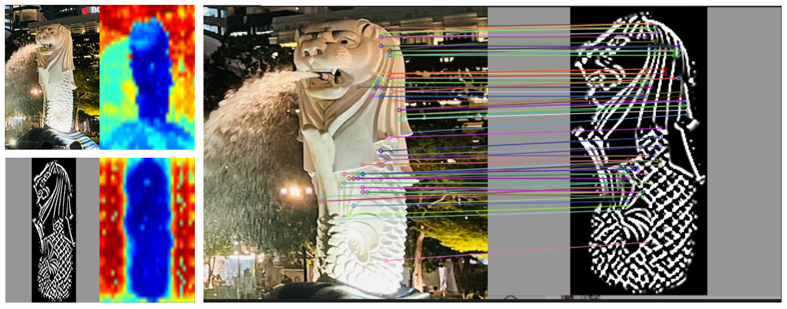
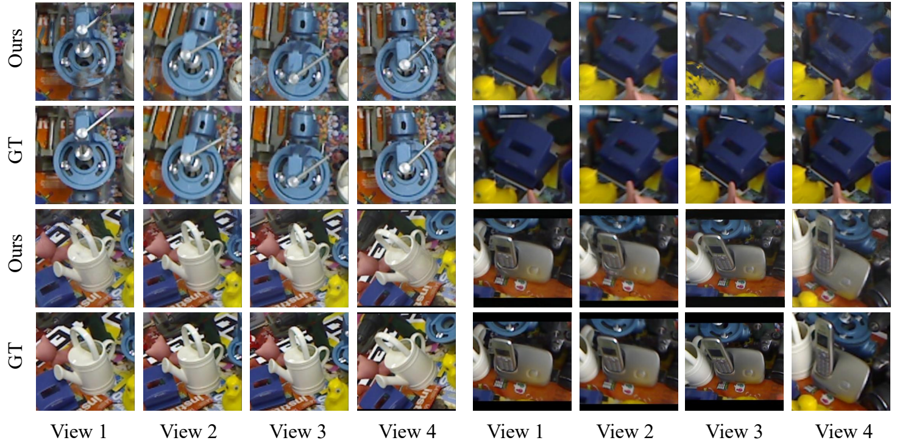

<div align="center">

<h1>POPE: 6-DoF Promptable Pose Estimation of Any Object, in Any Scene, with One Reference</h1>

[](https://paulpanwang.github.io/POPE/)
[](https://arxiv.org/abs/2305.15727)


<div>
        <a href="https://zhiwenfan.github.io/">Zhiwen Fan</a><strong><sup>1,*</sup></strong>,
        <a href="https://paulpanwang.github.io/">Panwang Pan</a><strong><sup>2,*</sup></strong>,
        <a href="https://peihaowang.github.io/">Peihao Wang</a><strong><sup>1</sup></strong>,
        <a href="https://yifanjiang19.github.io/">Yifan Jiang</a><strong><sup>1</sup></strong>, <br>
        <a href="https://ir1d.github.io/">Dejia Xu</a><strong><sup>1</sup></strong>,
        <a href="https://hwjiang1510.github.io/">Hanwen Jiang</a><strong><sup>1</sup></strong>, 
        <a href="https://vita-group.github.io/">Zhangyang Wang</a><strong><sup>1</sup></strong>
</div>
 <div>
    <sup>1</sup>The University of Texas at Austin &emsp;
    <sup>2</sup>ByteDance &emsp; 
         <sup>*</sup>denotes equal contribution
</div>



<strong> Welcome to the project repository for POPE (Promptable Pose Estimation), a state-of-the-art technique for 6-DoF pose estimation of any object in any scene using a single reference.</strong>
</div>


## Preparation

### Installation
The code is tested with python 3.9, cuda == 11.3, pytorch == 1.10.1. Additionally dependencies include: 

```bash
torch
torchvision
omegaconf
torchmetrics==0.10.3
fvcore
iopath
xformers
submitit
pathlib
transforms3d
numpy
plyfile
easydict
scikit-image
matplotlib
pyyaml
tabulate
numpy
tqdm
loguru
opencv-python
```

```bash
pip3 install -r ./requirements.txt
```

### Download model checkpoints
download SegmentAnything Model to weights
```bash
wget   https://dl.fbaipublicfiles.com/segment_anything/sam_vit_h_4b8939.pth  -O weights/sam_vit_h_4b8939.pth
```

download DINOv2 Model to weights
```bash
wget  https://dl.fbaipublicfiles.com/dinov2/dinov2_vits14/dinov2_vits14_pretrain.pth -O   weights/dinov2_vits14.pth
```


### Prepare datasets
1. Download  datasets from the official website: download OnePose dataset from [here](https://zjueducn-my.sharepoint.com/:f:/g/personal/zihaowang_zju_edu_cn/ElfzHE0sTXxNndx6uDLWlbYB-2zWuLfjNr56WxF11_DwSg?e=GKI0Df), YCBV dataset from [here](https://drive.google.com/file/d/1JpixHE9DN-W-BVFkVC12qss0CUu9VA8y/edit) and OnePose_LowTexture dataset from [here](https://zjueducn-my.sharepoint.com/:f:/g/personal/12121064_zju_edu_cn/ElfJC7FiK75Hhh1CF0sPVSQBdzJpeWpOfj8TZzRuxo9PUg?e=0mSTUS), and extract them into `./data`. 
If you want to evaluate on LINEMOD dataset, download the real training data, test data and 3D object models from [CDPN](https://github.com/LZGMatrix/CDPN_ICCV2019_ZhigangLi), and detection results by YOLOv5 from [here](https://zjueducn-my.sharepoint.com/:u:/g/personal/12121064_zju_edu_cn/EdodUdKGwHpCuvw3Cio5DYoBTntYLQuc7vNg9DkytWuJAQ?e=sAXp4B). Then extract them into `./data`

The directory should be organized in the following structure:
```
    |--📂data
    |       |--- 📂ycbv
    |       |--- 📂OnePose_LowTexture
    |       |--- 📂demos
    |       |--- 📂onepose
    |       |--- 📂LM_dataset
    |       |      |--- 📂bbox_2d
    |       |      |--- 📂corlor
    |       |      |--- 📂color_full
    |       |      |--- 📂intrin
    |       |      |--- 📂intrin_ba
    |       |      |--- 📂poses_ba
    |       |      |--- 📜box3d_corners.txt
    
```


### Demos
<div>
<font color="#dd0000">
Thank you for your attention, and I apologize for the excessive use of hard-coded values in the code. We have now organized the code structure and README to make it more user-friendly.  

The code has been recently tidied up for release and could perhaps contain tiny bugs. Please feel free to open an issue.
</font><br /> 
</div>

```bash
bash demo.sh
# Demo1: visual DINOv2 feature
python3 visual_dinov2.py

# Demo2: visual Segment Anything Model
python3 visual_sam.py
# Demo2: visual 3D BBox
python3 visual_3dbbox.py
```

<div>
  
</div>

<div>
    <video>
                <source src="https://github.com/paulpanwang/POPE/raw/main/docs/static/media/lm13_adjusted_compressed.f8829528fe5a67f5301f.mp4" type="video/mp4" />
    </video>
    <video>
                <source src="docs/static/media/MOUSE_G1_adjusted_compressed.e9504417d415b735e684.mp4" type="video/mp4" />
    </video>
</div>

### Evaluation
```bash
python3 eval_linemod_json.py
python3 eval_onepose_json.py
python3 eval_ycb_json.py

```


### Zero-shot Promtable Pose Estimation

Some Visual Examples of Promptable Object Pose Estimation Test Cases on Outdoor, indoor and scene with severe occlutions.


We also conduct a more challenging evaluation using an edge map as the reference,
which further demonstrates the robustness of POPE([DINOv2](https://github.com/paulpanwang/POPE/tree/main/dinov2) and [Matcher](https://github.com/paulpanwang/POPE/blob/main/src/matcher.py)).
<div>
  
</div>

### Application on Novel View Synthesis

We show the Application of Novel View Synthesis, by leveraging the estimated object poses, our method generate photo-realistic rendering results. we employ the estimated
 multi-view poses obtained from our POPE model, in combi nation with a pre-trained and generalizable Neural Radiance
 Field ([GNT](https://github.com/VITA-Group/GNT) and [Render](https://github.com/paulpanwang/POPE/tree/main/src/novel_view_render.py)) 

 


### Comparison based on Video and Image

We show Visualizations on LINEMOD, YCB-Video, OnePose and OnePose++ datasets, with the comparison with LoFTR and Gen6D.


## Citation

If you find this repo is helpful, please consider citing:
```bibtex
@article{fan2023pope,
  title={POPE: 6-DoF Promptable Pose Estimation of Any Object, in Any Scene, with One Reference},
  author={Fan, Zhiwen and Pan, Panwang and Wang, Peihao and Jiang, Yifan and Xu, Dejia and Jiang, Hanwen and Wang, Zhangyang},
  journal={arXiv preprint arXiv:2305.15727},
  year={2023}
}

```
